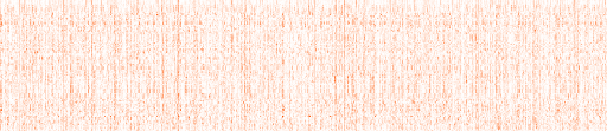

<h1 align='center'>IG-65M PyTorch</h1>

<p align=center>
  Unofficial PyTorch (and ONNX) 3D video classification models and weights pre-trained on IG-65M (65MM Instagram videos).

  
  <i>IG-65M activations for the Primer movie trailer video; time goes top to bottom</i>
</p>

<p align="center"><a href="https://travis-ci.org/moabitcoin/ig65m-pytorch"></a></p>


## PyTorch and ONNX Models :trophy:

We provide converted `.pth` and `.pb` PyTorch and ONNX weights, respectively.


| Model         | Pretrain\+Finetune       | Input Size | pth                                            | onnx                                       | caffe2                                                            |
|---------------|:-------------------------|:-----------|:-----------------------------------------------|:-------------------------------------------|:------------------------------------------------------------------|
|  R(2+1)D_34   | IG-65M + None            |  8x112x112 | [r2plus1d_34_clip8_ig65m_from_scratch-9bae36ae.pth](https://github.com/moabitcoin/ig65m-pytorch/releases/download/v1.0.0/r2plus1d_34_clip8_ig65m_from_scratch-9bae36ae.pth)           | [r2plus1d_34_clip8_ig65m_from_scratch-748ab053.pb](https://github.com/moabitcoin/ig65m-pytorch/releases/download/v1.0.0/r2plus1d_34_clip8_ig65m_from_scratch-748ab053.pb)           | [r2plus1d_34_clip8_ig65m_from_scratch.pkl](https://www.dropbox.com/s/6xwyu1az6oy4ts7/r2plus1d_34_clip8_ig65m_from_scratch_f79708462.pkl)               |
|  R(2+1)D_34   | IG-65M + Kinetics        |  8x112x112 | [r2plus1d_34_clip8_ft_kinetics_from_ig65m-0aa0550b.pth](https://github.com/moabitcoin/ig65m-pytorch/releases/download/v1.0.0/r2plus1d_34_clip8_ft_kinetics_from_ig65m-0aa0550b.pth)   | [r2plus1d_34_clip8_ft_kinetics_from_ig65m-625d61b3.pb](https://github.com/moabitcoin/ig65m-pytorch/releases/download/v1.0.0/r2plus1d_34_clip8_ft_kinetics_from_ig65m-625d61b3.pb)   | [r2plus1d_34_clip8_ft_kinetics_from_ig65m.pkl](https://www.dropbox.com/s/p81twy88kwrrcop/r2plus1d_34_clip8_ft_kinetics_from_ig65m_%20f128022400.pkl)   |
|  R(2+1)D_34   | IG-65M + None            | 32x112x112 | [r2plus1d_34_clip32_ig65m_from_scratch-449a7af9.pth](https://github.com/moabitcoin/ig65m-pytorch/releases/download/v1.0.0/r2plus1d_34_clip32_ig65m_from_scratch-449a7af9.pth)         | [r2plus1d_34_clip32_ig65m_from_scratch-e304d648.pb](https://github.com/moabitcoin/ig65m-pytorch/releases/download/v1.0.0/r2plus1d_34_clip32_ig65m_from_scratch-e304d648.pb)         | [r2plus1d_34_clip32_ig65m_from_scratch.pkl](https://www.dropbox.com/s/eimo232tqw8mwi9/r2plus1d_34_clip32_ig65m_from_scratch_f102649996.pkl)            |
|  R(2+1)D_34   | IG-65M + Kinetics        | 32x112x112 | [r2plus1d_34_clip32_ft_kinetics_from_ig65m-ade133f1.pth](https://github.com/moabitcoin/ig65m-pytorch/releases/download/v1.0.0/r2plus1d_34_clip32_ft_kinetics_from_ig65m-ade133f1.pth) | [r2plus1d_34_clip32_ft_kinetics_from_ig65m-10f4c3bf.pb](https://github.com/moabitcoin/ig65m-pytorch/releases/download/v1.0.0/r2plus1d_34_clip32_ft_kinetics_from_ig65m-10f4c3bf.pb) | [r2plus1d_34_clip32_ft_kinetics_from_ig65m.pkl](https://www.dropbox.com/s/z41ff7vs0bzf6b8/r2plus1d_34_clip32_ft_kinetics_from_ig65m_%20f106169681.pkl) |

Notes
- ONNX models provided here have not been optimized for inference.
- Models fine-tuned on Kinetics have 400 classes, the plain IG65 models 487 (32 clips), and 359 (8 clips) classes.
- For models fine-tuned on Kinetics you can use the labels from [here](https://github.com/Showmax/kinetics-downloader/blob/68bd8bc3b9e30da83db9e34cb7d867dcda705cb4/resources/classes.json).
- For plain IG65 models there is no label map available.
- Official Facebook Research Caffe2 models are [here](https://github.com/facebookresearch/vmz).


## Usage :computer:

The following describes how to use the model in your own project and how to use our conversion and extraction tools.

### In Your Own Project

- See the `convert` tool and copy the `r2plus1d_34` model architecture definition
- See the `extract` tool for how to load the corresponding weights into the model

Note: we require torchvision v0.4 or later for the model architecture building blocks

### Development and Tools

We provide CPU and [nvidia-docker](https://github.com/NVIDIA/nvidia-docker) based GPU Dockerfiles for self-contained and reproducible environments.

Use the convenience Makefile to build the Docker image and then get into the container mounting a host directory to `/data` inside the container:

```
make
make run datadir=/Path/To/My/Videos
```

By default we build and run the CPU Docker images; for GPUs run:

```
make dockerfile=Dockerfile.gpu
make gpu
```

The `WebcamDataset` requires exposing `/dev/video0` to the container which will only work on Linux:

```
make
make webcam
```


### Convert Weights :spaghetti:

Build the docker image and get into the container as described above.
Then see the `convert.py` tool's `--help` and its source.

### Extract Features :cookie:

Build the docker image and get into the container as described above.
Then see the `extract.py` tool's `--help` and its source.


## References :book:

1. D. Tran, H. Wang, L. Torresani, J. Ray, Y. LeCun and M. Paluri. **A Closer Look at Spatiotemporal Convolutions for Action Recognition.** CVPR 2018.
2. D. Tran, H. Wang, L. Torresani and M. Feiszli. **Video Classification with Channel-Separated Convolutional Networks.** ICCV 2019.
3. D. Ghadiyaram, M. Feiszli, D. Tran, X. Yan, H. Wang and D. Mahajan, **Large-scale weakly-supervised pre-training for video action recognition.** CVPR 2019.
4. [VMZ: Model Zoo for Video Modeling](https://github.com/facebookresearch/vmz)
5. [Kinetics](https://arxiv.org/abs/1705.06950) & [IG-65M](https://arxiv.org/abs/1905.00561)


## License

Copyright © 2019 MoabitCoin

Distributed under the MIT License (MIT).
